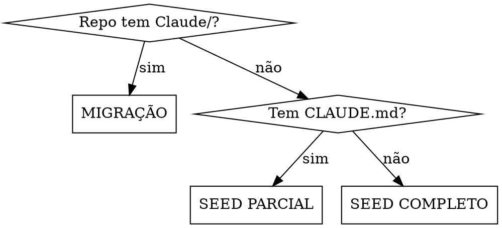

# Brain Seed — Montar o Cérebro do Repo

O Obsidian É o repo. Código é o coração. Vault é a consciência. Links são as veias. Este processo transforma qualquer repo num organismo vivo onde o Claude opera como dev senior.

## Diagnóstico



Executar: `ls Claude/ .obsidian/ CLAUDE.md docs/ 2>/dev/null`

---

## Fase 1 — Estudar (NÃO PULAR)

Despachar 3 subagents em paralelo:
1. **Core layer:** services, hooks, types, utils, contexts — TODA função, TODA interface
2. **Components/screens:** CADA componente com props, state, callbacks, regras
3. **Infra:** package.json, CI/CD, .env, tsconfig, testes existentes, deploy config

Se backend: rotas, models, schemas, migrations, queries SQL.

**Objetivo:** saber responder qualquer pergunta sobre o repo sem hesitar.

---

## Fase 2 — Criar Estrutura

### .obsidian/app.json
```json
{
  "alwaysUpdateLinks": true,
  "userIgnoreFilters": [
    "node_modules", "build", "dist", ".git", "__pycache__",
    "coverage", ".cache", ".next", "*.pyc",
    "docs", "src", "public", "Claude/_templates", "README.md"
  ]
}
```
Adaptar exclusões à stack. `docs`, `src`, `public` ficam fora do graph — não são conhecimento.

### .obsidian/community-plugins.json
```json
["dataview", "obsidian-git", "obsidian-templater-plugin"]
```

### Plugin configs (criar cada pasta + data.json):
```
.obsidian/plugins/dataview/data.json:
{"renderNullAs":"—","taskCompletionTracking":true,"enableDataviewJs":false,"enableInlineDataview":true}

.obsidian/plugins/obsidian-git/data.json:
{"autoSaveInterval":0,"autoPullOnBoot":true,"autoPullInterval":0,"autoPushAfterCommit":false,"commitMessage":"vault: atualizar notas Claude","pullBranch":"master"}

.obsidian/plugins/obsidian-templater-plugin/data.json:
{"templates_folder":"Claude/_templates","trigger_on_file_creation":false,"auto_jump_to_cursor":true}
```

### .gitignore — NÃO incluir .obsidian. Tudo versionado.

### CLAUDE.md (~150 linhas)
Estrutura exata:
```
# CLAUDE.md — {repo-name}
{descrição 1 linha}

## Comandos
## Arquitetura (tree do src/ com 1 linha por arquivo/pasta chave)
## Gotchas (coisas que causam erro se não souber)
## Regras de Negócio (resumo, apontar pra Claude/regras-negocio.md)
## Integrações (endpoints consumidos/expostos, auth flow)
## Bugs Conhecidos (tabela: fase, bug, severidade, status)
## Obsidian Vault — Tiers de Leitura (tabela T1/T2/T3 com tokens estimados)
```

---

## Fase 3 — Notas T1 (criar TODAS, ~3K tokens total)

### Frontmatter padrão (copiar pra toda nota):
```yaml
---
title: {título descritivo}
type: architecture | business-rules | dependencies | tech-debt | bug | post-mortem | flow | anatomy | reference | moc | adr
status: active | draft | review | archived | resolved
tags:
  - {tag1}
  - {tag2}
created: {YYYY-MM-DD}
updated: {YYYY-MM-DD}
owner: claude
project: {repo-name}
related:
  - "[[nota-relacionada]]"
tier: 1 | 2 | 3
---
```

### Notas obrigatórias T1:

**arquitetura.md** — CADA módulo/pasta com: responsabilidade, exports chave, dependências, LOC, padrões usados

**regras-negocio.md** — TUDO que não é óbvio pelo código: como dados fluem, o que cada campo significa, edge cases de negócio, formulas

**bugs-conhecidos.md** — TODO bug com: status, onde (arquivo:~linha), descrição, impacto, fix proposto. Se backend é repo separado, marcar explicitamente.

**tech-debt.md** — Por severidade (alta/média/baixa): débito, onde, impacto. Inclui: libs desatualizadas, código duplicado, anti-patterns, licenças expiradas.

**dependencias.md** — Grafo textual: quem importa quem. Anomalias (ex: "authService usa axios raw em vez de axiosInstance"). Libs críticas com versão.

**glossario.md** — TODO termo de domínio: definição, fórmula se aplicável, `[[link]]` pra nota que usa. Formato: `### Termo\nDefinição. Ver [[nota]].`

---

## Fase 4 — Notas T2 (sob demanda, ~10K tokens total)

**mapa-requests.md** — Grep TODO `axiosInstance.`, `axios.`, `fetch(` no código. Para CADA request:
| # | Arquivo:Linha | Método | Endpoint | Auth (axiosInstance/raw/fetch) | Propósito PT-BR | Bug? |

**render-tree.md** (frontend) — Árvore completa: `index.tsx → App → Screen → Components`. Para componentes chave: listar props exatos passados pelo pai.

**error-handling.md** — Para CADA request do mapa: o que acontece on success, on error, o que o usuário vê. Marcar os perigosos (catch silencioso, default permissivo).

**deploy.md** — Como código chega a produção. CI/CD config. Env vars de build. Se merge=prod, MARCAR EM VERMELHO.

**infra-testes.md** — Rodar `find src -name "*.test.*"`. Listar cada teste. Como rodar (`yarn test`, `pytest`). O que falta (priorizado).

**env-setup.md** — Env vars necessárias. Como obter token. Como apontar pra backend. Diferenças CRA vs Vite se aplicável.

Notas por módulo complexo (ex: `editablegrid.md`): props, state, callbacks, fluxo de dados, bugs.

---

## Fase 5 — Notas T3 (referência, ~16K tokens)

**ADRs** — 1 por decisão arquitetural. Formato:
```
# ADR-NNN — {Título}
## Contexto (por que precisou decidir)
## Decisão (o que foi escolhido)
## Consequências (+/-)
## Alternativas Consideradas
```

**Runbooks** — Tarefas recorrentes. Formato: steps numerados com links `[[]]` pra notas relevantes. Seção "Notas Relacionadas" no final.

**Post-mortems** — Bugs resolvidos. Formato: Incidente, Causa Raiz, Impacto, Fix, Lições.

**Specs migradas** — Docs de features que contêm conhecimento de domínio → mover pra Claude/. Artefatos de processo (plans, execution steps) → manter em docs/.

---

## Fase 6 — MOCs + Templates

### 5 MOCs (criar todos):
- `_MOC Onboarding.md` — sequência de leitura: glossário → regras → arquitetura → módulos → bugs → ADRs → runbooks → deploy
- `_MOC {Domínio 1}.md` — ex: Frontend, Backend, API
- `_MOC {Domínio 2}.md` — ex: segundo domínio relevante
- `_MOC Bugs.md` — bugs por fase, por componente, queries Dataview
- `_MOC Specs & Performance.md` — features + otimizações

CADA MOC termina com seção Navegação linkando TODOS os outros MOCs.

### 5 Templates (criar em `Claude/_templates/`):
- `post-mortem.md`
- `anatomia-componente.md`
- `bug-report.md`
- `nota-livre.md`
- `adr.md`

Todos com frontmatter completo usando `{{date:YYYY-MM-DD}}` e `{{title}}` do Templater.

---

## Fase 7 — Validar (NÃO PULAR)

Executar TODOS estes checks:

```bash
# 1. Contar notas e links
find Claude/ -name '*.md' -not -path '*/_templates/*' -type f | wc -l
grep -ro '\[\[' Claude/ --include='*.md' | wc -l

# 2. Encontrar ilhas (zero outbound links)
find Claude/ -name "*.md" -not -path "*/_templates/*" -type f -print0 | \
while IFS= read -r -d '' f; do
  out=$(grep -co '\[\[' "$f" 2>/dev/null || echo 0)
  if [ "$out" -eq 0 ]; then echo "ILHA: $f"; fi
done

# 3. Verificar todas requests mapeadas
echo "Requests no código:"
grep -rn "axiosInstance\.\|axios\.\|[^a-zA-Z]fetch(" src/ --include="*.ts" --include="*.tsx" --include="*.jsx" | grep -v node_modules | grep -v "refetch\|fetchData\|fetchUsers" | wc -l
echo "Requests no mapa:"
grep -c "| [0-9]" Claude/mapa-requests.md

# 4. Verificar frontmatter em todas notas
find Claude/ -name "*.md" -not -path "*/_templates/*" -type f -print0 | \
while IFS= read -r -d '' f; do
  has_fm=$(head -1 "$f" | grep -c "^---$")
  if [ "$has_fm" -eq 0 ]; then echo "SEM FRONTMATTER: $f"; fi
done
```

Cruzar 3+ notas contra código real (verificar line numbers, comportamentos, contradições). Corrigir tudo encontrado.

---

## Fase 8 — Sustentar

### Verificar que skill /knowledge-sync existe em ~/.claude/skills/knowledge-sync/

### Hook Stop em .claude/settings.local.json:
```json
{
  "hooks": {
    "Stop": [{
      "hooks": [{
        "type": "command",
        "command": "cd {REPO_PATH} && src_changed=$(git diff --name-only 2>/dev/null | grep -c '^src/' || true) && claude_changed=$(git diff --name-only 2>/dev/null | grep -c '^Claude/' || true) && if [ \"$src_changed\" -gt 0 ] && [ \"$claude_changed\" -eq 0 ]; then echo '{\"systemMessage\":\"Codigo alterado mas Claude/ nao foi atualizado. Use /knowledge-sync.\"}'; fi",
        "timeout": 10
      }]
    }]
  }
}
```
Substituir `{REPO_PATH}` pelo path absoluto do repo. Merge com permissions existentes.

---

## Taxonomia de Tags

```
Domínio:    #frontend  #backend  #database  #frontend/grid  #backend/kpi  #backend/auth
Problema:   #bug  #bug/fase-0..3  #debt/alta  #debt/media  #debt/baixa
Padrão:     #pattern  #pattern/react-query  #pattern/singleton  #pattern/facade
Status:     #resolved  #pending  #in-progress
Tipo:       #feature  #performance  #post-mortem  #cross-repo  #moc  #adr  #runbook  #onboarding
```

Max 5 tags por nota. Não inventar — usar estas ou documentar nova na taxonomia.

---

## Erros que NÃO repetir (lições do hinc-onepage)

1. **NÃO criar subpastas de categorização** (specs/, performance/, refs/) — achatar depois custa mais
2. **NÃO usar nomes de ticket** (US-PERF-001) — usar nomes de conceito (batch-processing)
3. **NÃO usar markdown links** `[text](path)` — SEMPRE wiki links `[[path|text]]`
4. **NÃO colocar .obsidian no .gitignore** — é parte do repo
5. **NÃO duplicar conteúdo do workspace CLAUDE.md** — o repo CLAUDE.md complementa, não repete
6. **NÃO documentar antes de ler o código** — estudar primeiro, documentar depois
7. **NÃO confiar em line numbers sem verificar** — código muda, notas ficam stale
8. **NÃO listar card_type/enum sem confirmar no código** — já erramos isso uma vez
9. **NÃO esquecer de linkar runbooks** — sem links outbound viram ilhas mortas
10. **NÃO assumir que backend e frontend estão no mesmo repo** — verificar sempre

---

## Migração (repo que já tem CLAUDE.md/docs)

1. `Ler TUDO` que já existe — CLAUDE.md, docs/, memory files, .claude/settings
2. `Classificar` cada doc: conhecimento de domínio (→ Claude/) ou artefato de processo (→ manter em docs/)
3. `Migrar` conhecimento com frontmatter + wiki links + nome de conceito
4. `Evoluir` CLAUDE.md existente — não substituir. Adicionar tiers, referências ao vault.
5. `Preservar` memory files — atualizar paths se necessário
6. `Preservar` regras do settings — só adicionar hook, não sobrescrever permissions
7. **Nunca deletar sem entender.** Na dúvida, pergunte.

---

## Checklist Final (apresentar ao dev)

- [ ] Todas notas T1 criadas com frontmatter
- [ ] Mapa de requests completo (grep vs notas bateu)
- [ ] Zero ilhas (toda nota tem links in e out)
- [ ] MOCs interligados
- [ ] Templates criados
- [ ] CLAUDE.md com tiers
- [ ] .obsidian/ versionado
- [ ] Hook Stop configurado
- [ ] Contradições verificadas e corrigidas
- [ ] Dev revisou e aprovou
